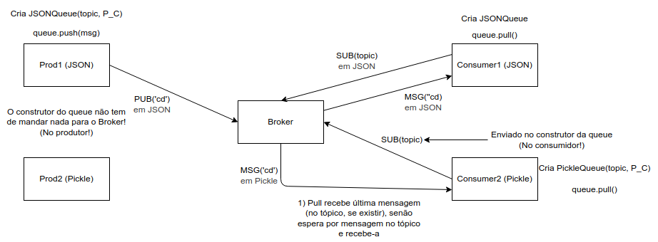

# Guião 3 - Message Broker

O Broker tem 2 tipos de clientes:
- Produtores -> Mandam mensagens (Corresponde a **publish**)
  - ***publish (topic, message)***
- Consumidores -> Subscrevem a um tópico (Corresponde a **subscribe** )
  - ***subscribe (topic)***
  
Em vez de fazermos publish, vamos fazer push -> ***queue.push(msg)***

**Nota:** ***queue.pull()*** é bloqueante, ou seja, bloqueia até que alguém publique naquele tópico.

**Nota:** ***subscribe(topic)*** é feito pelo consumidor através do construtor da queue.

**Nota:** ***middleware.py*** é onde temos as queues dos produtores e dos consumidores (JSON, XML e Pickle).

Além do **publish()** e **subscribe()**, queremos que seja adaptado a diferentes formatos, por exemplo:
- Produtor que funciona em PICKLE e um consumidor em JSON.
- Quando o broker receber a mensagem, vai traduzí-la antes de enviar ao consumidor.

***Nota:*** O broker é um intermediário.

---
### Como é que o Broker sabe como o produtor e o consumidor trabalham?

Vamos admitir que todas as mensagens entre Produtores e Broker têm um header de 1 byte que indica:
  - ***JSON -> 0***
  - ***XML -> 1***
  - ***PICKLE -> 2***

***Nota: O middleware não é usado pelo Broker, apesar do nome parecer que indica o contrário***

O middleware só é usado nestes sentidos:
  - Produtores -> Broker
  - Consumidores -> Broker

---
### Recomendações

- Começar com um Broker que funciona só em JSON (Para fazer as coisas funcionarem e depois implenta-se o resto)
- Cada consumer liga-se a 1 tópico e cada queue também só se liga a 1 tópico.
- Talvez valha a pena criar um ***protocol.py*** para tratar das sockets e dos diferentes tipos que vamos ter de trabalhar.
  - ***Nota: Semelhante ao protocol.py que foi utilizado no chat server (Guião 1)***

### Notas Gerais
- Os produtores podem enviar para vários tópicos.
- O Broker tem memória e sabe a última mensagem que circulou em cada tópico
- Broker pode conhecer tópicos que não têm valor
  - ***Nota:*** Tópico já ter um valor -> Alguém já publicou esse tópico
- Quando há a subscrição a um tópico (por parte do consumidor), o broker envia automaticamente a última mensagem desse tópico. 
- Os tópicos são hierárquicos, se subscrever um tópic, eu recebo tudo o que está publicado no tópioc e nos seus descendentes.
